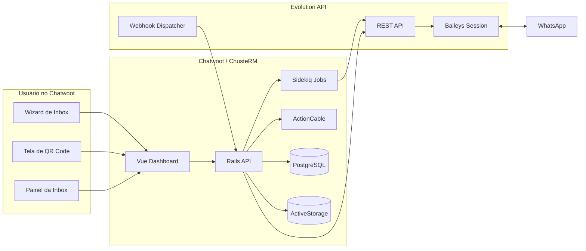
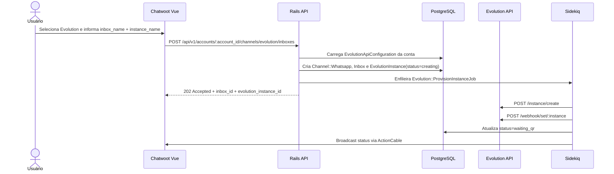
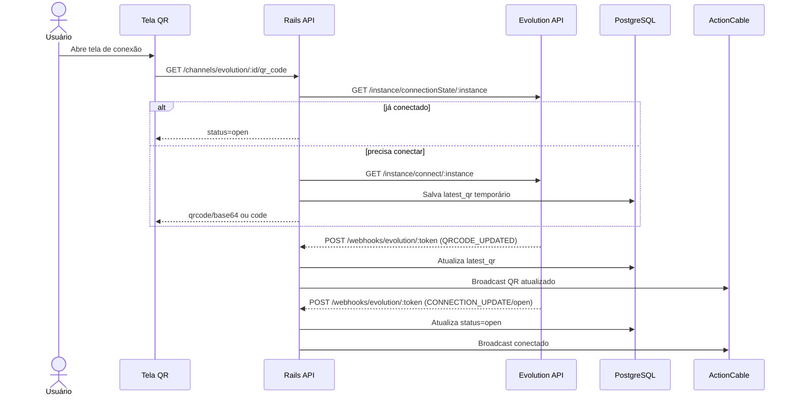
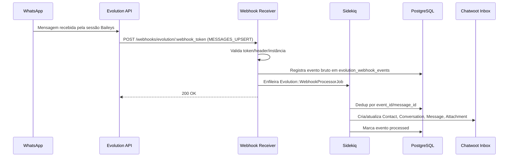
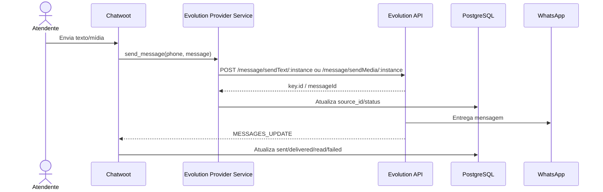

# Integração Evolution API no Chatwoot

Documento de planejamento técnico para automatizar o ciclo de vida de instâncias da Evolution API no fork ChusteRM/Chatwoot.

## 1. Visão Geral e Motivação

O fork já possui suporte inicial ao provedor `evolution` para canais WhatsApp:

- Provider Rails: `Whatsapp::Providers::EvolutionService`.
- Receiver público: `Webhooks::EvolutionController`.
- Job de eventos: `Webhooks::EvolutionEventsJob`.
- Processador de mensagens: `Whatsapp::IncomingMessageEvolutionService`.
- Polling de saúde: `Channels::EvolutionConnectionHealthJob`.
- Wizard Vue com opção "Evolution API (Baileys)".
- Tela final/settings com polling de QR Code.

O ponto fraco atual é que a experiência ainda mistura configuração operacional da Evolution com criação de inbox. O usuário precisa informar URL, chave, número e instância, e parte do fluxo ainda pressupõe que a instância pode ter sido criada no Manager da Evolution.

O objetivo desta evolução é transformar a Evolution API em um provedor gerenciado pelo Chatwoot: o usuário final escolhe Evolution, informa nome da caixa e nome da instância, escaneia o QR Code dentro do Chatwoot e passa a operar o canal sem acessar o painel da Evolution.

## 2. Objetivos

1. Centralizar a configuração global da Evolution API por conta ou instalação.
2. Criar, configurar, conectar, monitorar, reconectar e excluir instâncias a partir do Chatwoot.
3. Reduzir passos manuais e erros de webhook.
4. Fortalecer segurança, idempotência, logs e auditoria.
5. Preservar compatibilidade com o modelo nativo do Chatwoot: `Inbox`, `Channel::Whatsapp`, `Conversation`, `Contact`, `Message` e `Attachment`.

## 3. Decisões Arquiteturais

### 3.1 Configuração global por conta

Recomendação: criar uma tabela dedicada `evolution_api_configurations` com `account_id`, `base_url`, `global_api_key`, `webhook_base_url` e `webhook_secret`.

Motivo:

- Evita expor `api_key` e `api_url` no wizard de inbox.
- Permite validação e rotação de credenciais em um lugar só.
- Mantém suporte multi-tenant.
- Facilita auditoria e troubleshooting.

Alternativa mais simples: usar `InstallationConfig` ou ENV globais. Serve para instalações single-tenant, mas piora isolamento entre contas.

### 3.2 Estado da instância em tabela própria

Recomendação: adicionar `evolution_instances` vinculada a `account`, `inbox` e `channel_whatsapp`.

Motivo:

- `provider_config` do canal deve continuar existindo, mas não deve concentrar segredos, estado mutável, QR temporário, locks e auditoria.
- Uma tabela própria permite índices, estados, retries, circuit breaker e idempotência com clareza.

### 3.3 Encapsular HTTP em client resiliente

Criar `Evolution::Client` com timeout, retry, backoff, circuit breaker, logs estruturados e normalização de erros.

Motivo:

- Hoje `Whatsapp::Providers::EvolutionService` chama `HTTParty` diretamente.
- A lógica tende a crescer com criação, status, QR, logout, restart, delete, webhooks e mensagens.
- Um client central reduz duplicação e torna os testes melhores.

## 4. Arquitetura Alvo



## 5. Fluxos Principais

### 5.1 Criação de instância



### 5.2 Conexão por QR Code



### 5.3 Recebimento de mensagem



### 5.4 Envio de mensagem



## 6. Endpoints da Evolution API Consumidos

Notas:

- O fork atual usa rotas v2 documentadas pela Evolution API, como `/instance/create`, `/instance/connect/:instance`, `/instance/connectionState/:instance`, `/instance/fetchInstances`, `/webhook/set/:instance`, `/message/sendText/:instance` e `/message/sendMedia/:instance`.
- Alguns deployments da Evolution podem variar por versão. Onde houver dúvida de payload ou rota, manter `// TODO: confirmar na doc oficial` antes de implementar.

| Uso | Método | Rota | Payload esperado | Resposta esperada | Status no fork atual |
| --- | --- | --- | --- | --- | --- |
| Health/conectividade | `GET` | `/` ou endpoint de health da instalação | nenhum | informações da API, versão ou 200 OK | Parcial via GET `/` no `EvoManagerController`; formalizar |
| Listar instâncias | `GET` | `/instance/fetchInstances` | nenhum | array ou objeto com `instances/data/value` | Implementado em `remote_fetch_instances` |
| Criar instância | `POST` | `/instance/create` | `{ "instanceName": "...", "integration": "WHATSAPP-BAILEYS", "qrcode": true }` | dados da instância e/ou QR | Implementado parcialmente |
| Conectar / obter QR | `GET` | `/instance/connect/:instance` | nenhum; alguns setups aceitam número para pairing code | QR base64, code, pairingCode, count | Implementado parcialmente |
| Estado de conexão | `GET` | `/instance/connectionState/:instance` | nenhum | `{ "instance": { "state": "open" } }` ou `{ "state": "open" }` | Implementado |
| Configurar webhook | `POST` | `/webhook/set/:instance` | `{ "webhook": { "enabled": true, "url": "...", "headers": {}, "webhookByEvents": false, "events": [] } }` | confirmação | Implementado parcialmente |
| Consultar webhook | `GET` | `/webhook/find/:instance` | nenhum | configuração atual | Adicionar |
| Desconectar/logout | `DELETE` | `/instance/logout/:instance` | nenhum | confirmação | Adicionar |
| Reiniciar instância | `PUT` ou `POST` | `/instance/restart/:instance` | nenhum | confirmação | `// TODO: confirmar método na doc oficial` |
| Excluir instância | `DELETE` | `/instance/delete/:instance` | nenhum | confirmação | Adicionar |
| Enviar texto | `POST` | `/message/sendText/:instance` | `{ "number": "5511999999999", "text": "Olá" }` | `key.id` ou `messageId` | Implementado |
| Enviar mídia | `POST` | `/message/sendMedia/:instance` | `{ "number": "...", "mediatype": "image", "media": "url/base64", "caption": "", "fileName": "" }` | `key.id` ou `messageId` | Implementado |
| Foto/perfil da instância | `GET` ou endpoint de chat/profile | `// TODO: confirmar na doc oficial` | `// TODO` | profile name, avatar URL, owner phone | Adicionar após validar versão |

### 6.1 Payload de criação de instância

```json
{
  "instanceName": "coimbra-whatsapp-principal",
  "integration": "WHATSAPP-BAILEYS",
  "qrcode": true
}
```

### 6.2 Payload de configuração de webhook

```json
{
  "webhook": {
    "enabled": true,
    "url": "https://crm.exemplo.com/webhooks/evolution/evt_abc123",
    "headers": {
      "x-chatwoot-evolution-signature": "assinatura-ou-token"
    },
    "webhookByEvents": false,
    "events": [
      "MESSAGES_UPSERT",
      "MESSAGES_UPDATE",
      "CONNECTION_UPDATE",
      "QRCODE_UPDATED",
      "SEND_MESSAGE",
      "LOGOUT_INSTANCE",
      "REMOVE_INSTANCE"
    ]
  }
}
```

Recomendação: evitar webhook por telefone no caminho público. Usar token opaco gerado pelo Chatwoot:

```text
POST /webhooks/evolution/:webhook_token
```

O token fica em `evolution_instances.webhook_token` ou no canal, cifrado/hasheado conforme necessidade. O telefone não deve ser identificador primário da rota.

## 7. Eventos de Webhook e Mapeamento para Chatwoot

| Evento Evolution | Payload relevante | Ação no Chatwoot | Idempotência |
| --- | --- | --- | --- |
| `MESSAGES_UPSERT` / `messages.upsert` | `data.key.id`, `data.key.remoteJid`, `data.key.fromMe`, `data.message`, `data.messageType` | Criar `Contact`, `ContactInbox`, `Conversation`, `Message` incoming | `message.source_id = key.id`; índice recomendado por inbox/source_id |
| `MESSAGES_UPDATE` / `messages.update` | `data.key.id`, `data.status` | Atualizar status da mensagem: sent/delivered/read/failed | Evento por `message_id + status` |
| `CONNECTION_UPDATE` / `connection.update` | `data.state`, `data.error`, `data.reason` | Atualizar `evolution_instances.connection_state`, `last_connected_at`, `last_disconnected_at`, `reauthorization_required` | Último estado vence; registrar auditoria |
| `QRCODE_UPDATED` / `qrcode.updated` | `data.qrcode`, `data.base64`, `data.code` | Atualizar QR temporário e transmitir via ActionCable | Dedup por hash do QR + timestamp curto |
| `SEND_MESSAGE` / `send.message` | `data.key.id`, `data.message` | Correlacionar envio iniciado pela Evolution, se necessário | Opcional; não criar duplicado |
| `LOGOUT_INSTANCE` | reason/error | Marcar canal como desconectado e requerendo reautorização | Evento único por timestamp |
| `REMOVE_INSTANCE` | reason/error | Marcar instância como removida, bloquear envio | Evento único por timestamp |

### 7.1 Normalização de mensagem recebida

Exemplo simplificado:

```ruby
class Evolution::MessageMapper
  def initialize(data)
    @data = data.with_indifferent_access
  end

  def source_id
    @data.dig(:key, :id)
  end

  def from_me?
    ActiveModel::Type::Boolean.new.cast(@data.dig(:key, :fromMe))
  end

  def phone
    remote_jid = @data.dig(:key, :remoteJid).to_s
    return sender_pn if remote_jid.end_with?('@lid') && sender_pn.present?

    remote_jid.split('@').first
  end

  def text
    message = @data[:message] || {}
    message[:conversation] ||
      message.dig(:extendedTextMessage, :text) ||
      message.dig(:imageMessage, :caption) ||
      message.dig(:videoMessage, :caption) ||
      message.dig(:documentMessage, :caption)
  end

  private

  def sender_pn
    @data.dig(:key, :senderPn).to_s.split('@').first
  end
end
```

### 7.2 Suporte a mídias

Mapear `messageType`:

| Evolution `messageType` | Chatwoot `attachment.file_type` | Observações |
| --- | --- | --- |
| `imageMessage` | `image` | Usar caption como `Message#content` |
| `audioMessage` | `audio` | Preservar mimetype e duração se vier no payload |
| `videoMessage` | `video` | Usar caption quando existir |
| `documentMessage` | `file` | Usar `fileName` |
| `stickerMessage` | `image` ou `file` | Preferir `image` para webp; validar render |

O fork atual baixa mídia por `url/directPath`. Evoluir para:

- aceitar `url`, `mediaUrl`, `directPath` ou base64 quando a Evolution enviar;
- enfileirar download em job separado para payloads grandes;
- registrar falhas em `evolution_webhook_events.error_message`;
- evitar retry infinito quando a mídia expirar.

## 8. Mudanças de Banco de Dados

### 8.1 `evolution_api_configurations`

```bash
cd core
bundle exec rails g migration CreateEvolutionApiConfigurations
```

```ruby
class CreateEvolutionApiConfigurations < ActiveRecord::Migration[7.1]
  def change
    create_table :evolution_api_configurations do |t|
      t.references :account, null: false, foreign_key: true, index: { unique: true }
      t.string :base_url, null: false
      t.string :webhook_base_url, null: false
      t.text :global_api_key
      t.string :webhook_secret_digest
      t.string :health_status, null: false, default: 'unknown'
      t.datetime :last_health_check_at
      t.text :last_health_error
      t.jsonb :settings, null: false, default: {}

      t.timestamps
    end
  end
end
```

Model:

```ruby
class EvolutionApiConfiguration < ApplicationRecord
  belongs_to :account

  encrypts :global_api_key if ChusteRM.encryption_configured?

  validates :base_url, :webhook_base_url, presence: true
  validates :account_id, uniqueness: true

  before_validation :normalize_urls

  private

  def normalize_urls
    self.base_url = base_url.to_s.chomp('/')
    self.webhook_base_url = webhook_base_url.to_s.chomp('/')
  end
end
```

### 8.2 `evolution_instances`

```bash
cd core
bundle exec rails g migration CreateEvolutionInstances
```

```ruby
class CreateEvolutionInstances < ActiveRecord::Migration[7.1]
  def change
    create_table :evolution_instances do |t|
      t.references :account, null: false, foreign_key: true
      t.references :inbox, null: true, foreign_key: true
      t.references :channel_whatsapp, null: true, foreign_key: { to_table: :channel_whatsapp }
      t.string :instance_name, null: false
      t.string :external_instance_id
      t.string :webhook_token, null: false
      t.string :connection_state, null: false, default: 'unknown'
      t.string :provisioning_status, null: false, default: 'pending'
      t.string :phone_number
      t.string :profile_name
      t.string :profile_picture_url
      t.text :latest_qr
      t.string :latest_qr_hash
      t.datetime :latest_qr_at
      t.datetime :last_connected_at
      t.datetime :last_disconnected_at
      t.datetime :last_sync_at
      t.integer :failure_count, null: false, default: 0
      t.datetime :circuit_open_until
      t.text :last_error
      t.jsonb :metadata, null: false, default: {}

      t.timestamps
    end

    add_index :evolution_instances, [:account_id, :instance_name], unique: true
    add_index :evolution_instances, :webhook_token, unique: true
    add_index :evolution_instances, :connection_state
    add_index :evolution_instances, :provisioning_status
  end
end
```

### 8.3 `evolution_webhook_events`

```ruby
class CreateEvolutionWebhookEvents < ActiveRecord::Migration[7.1]
  def change
    create_table :evolution_webhook_events do |t|
      t.references :account, null: false, foreign_key: true
      t.references :inbox, null: true, foreign_key: true
      t.references :evolution_instance, null: true, foreign_key: true
      t.string :event_name, null: false
      t.string :instance_name
      t.string :message_id
      t.string :event_uid
      t.string :status, null: false, default: 'received'
      t.jsonb :payload, null: false, default: {}
      t.text :error_message
      t.datetime :processed_at

      t.timestamps
    end

    add_index :evolution_webhook_events, :event_name
    add_index :evolution_webhook_events, :status
    add_index :evolution_webhook_events, [:evolution_instance_id, :event_uid], unique: true, where: "event_uid IS NOT NULL"
    add_index :evolution_webhook_events, [:evolution_instance_id, :message_id, :event_name], name: 'idx_evo_events_instance_message_event'
  end
end
```

### 8.4 Índice de mensagens por source_id

Confirmar se já existe índice adequado. Se não existir:

```ruby
add_index :messages, [:inbox_id, :source_id],
          unique: true,
          where: "source_id IS NOT NULL",
          name: "index_messages_on_inbox_id_and_source_id_unique"
```

## 9. Backend Rails

### 9.1 Controllers

Criar/expandir:

```text
app/controllers/api/v1/accounts/evolution/configurations_controller.rb
app/controllers/api/v1/accounts/channels/evolution/inboxes_controller.rb
app/controllers/api/v1/accounts/channels/evolution/instances_controller.rb
app/controllers/webhooks/evolution_controller.rb
```

Rotas sugeridas:

```ruby
namespace :api, defaults: { format: 'json' } do
  namespace :v1 do
    resources :accounts, only: [] do
      namespace :evolution do
        resource :configuration, only: [:show, :create, :update] do
          post :validate
        end
      end

      namespace :channels do
        namespace :evolution do
          resources :inboxes, only: [:create]
          resources :instances, only: [:show, :destroy], param: :id do
            member do
              get :qr_code
              get :connection_status
              post :reconnect
              post :logout
              post :restart
              post :sync
            end
          end
        end
      end
    end
  end
end

post 'webhooks/evolution/:webhook_token', to: 'webhooks/evolution#process_payload'
get  'webhooks/evolution/:webhook_token', to: 'webhooks/evolution#verify'
```

Manter as rotas atuais por telefone como legado durante uma fase:

```ruby
post 'webhooks/evolution/*phone_number', to: 'webhooks/evolution#process_payload_legacy'
```

### 9.2 Services

#### `Evolution::Client`

Responsável por chamadas HTTP:

```ruby
module Evolution
  class Client
    DEFAULT_TIMEOUT = 10

    def initialize(configuration:)
      @configuration = configuration
    end

    def create_instance(instance_name:)
      post('/instance/create', {
        instanceName: instance_name,
        integration: 'WHATSAPP-BAILEYS',
        qrcode: true
      })
    end

    def set_webhook(instance_name:, url:, headers:, events:)
      post("/webhook/set/#{instance_name}", {
        webhook: {
          enabled: true,
          url: url,
          headers: headers,
          webhookByEvents: false,
          events: events
        }
      })
    end

    def connection_state(instance_name:)
      get("/instance/connectionState/#{instance_name}")
    end

    def connect(instance_name:)
      get("/instance/connect/#{instance_name}")
    end

    private

    def get(path)
      request(:get, path)
    end

    def post(path, body)
      request(:post, path, body: body)
    end

    def request(method, path, body: nil)
      # Implementar Faraday/HTTParty com timeout, retry e logs estruturados.
      # TODO: padronizar exceções Evolution::TimeoutError, Evolution::ApiError etc.
    end
  end
end
```

#### `Evolution::InstanceService`

Orquestra criação e ciclo de vida:

```ruby
module Evolution
  class InstanceService
    EVENTS = %w[
      MESSAGES_UPSERT
      MESSAGES_UPDATE
      CONNECTION_UPDATE
      QRCODE_UPDATED
      SEND_MESSAGE
      LOGOUT_INSTANCE
      REMOVE_INSTANCE
    ].freeze

    def initialize(instance:)
      @instance = instance
      @client = Evolution::Client.new(configuration: instance.configuration)
    end

    def provision!
      @instance.update!(provisioning_status: 'creating')
      @client.create_instance(instance_name: @instance.instance_name)
      configure_webhook!
      @instance.update!(provisioning_status: 'waiting_qr')
    rescue StandardError => e
      @instance.update!(provisioning_status: 'failed', last_error: e.message)
      raise
    end

    def configure_webhook!
      @client.set_webhook(
        instance_name: @instance.instance_name,
        url: webhook_url,
        headers: webhook_headers,
        events: EVENTS
      )
    end

    private

    def webhook_url
      "#{@instance.configuration.webhook_base_url}/webhooks/evolution/#{@instance.webhook_token}"
    end

    def webhook_headers
      { 'x-evolution-webhook-token' => @instance.webhook_token }
    end
  end
end
```

#### `Evolution::WebhookProcessorService`

Responsável por:

- normalizar evento;
- garantir idempotência;
- mapear `MESSAGES_UPSERT` para `Whatsapp::IncomingMessageEvolutionService` ou substituto novo;
- mapear status de entrega;
- atualizar `EvolutionInstance`;
- criar auditoria.

### 9.3 Jobs Sidekiq

```text
app/jobs/evolution/provision_instance_job.rb
app/jobs/evolution/configure_webhook_job.rb
app/jobs/evolution/fetch_qr_code_job.rb
app/jobs/evolution/sync_connection_status_job.rb
app/jobs/evolution/webhook_processor_job.rb
app/jobs/evolution/media_download_job.rb
app/jobs/evolution/delete_instance_job.rb
```

Padrões:

- fila `low` para sync/status;
- fila `default` para webhook;
- retry controlado por tipo de erro;
- `discard_on ActiveRecord::RecordNotFound`;
- `retry_on Evolution::TimeoutError, wait: :exponentially_longer, attempts: 5`.

### 9.4 ActionCable

Criar canal:

```text
app/channels/evolution_instance_channel.rb
```

Eventos transmitidos:

```json
{
  "type": "connection_update",
  "instance_id": 123,
  "state": "open",
  "last_sync_at": "2026-05-19T12:00:00Z"
}
```

```json
{
  "type": "qrcode_updated",
  "instance_id": 123,
  "qrcode": "data:image/png;base64,...",
  "pairing_code": "12345678"
}
```

### 9.5 Segurança do webhook

Ordem recomendada:

1. Usar URL com token opaco.
2. Validar header configurado na Evolution (`x-evolution-webhook-token` ou `apikey`).
3. Se a Evolution suportar assinatura HMAC oficial, preferir `X-Evolution-Signature`.
4. Fazer `secure_compare`.
5. Não retornar detalhes de erro no receiver público.

Exemplo:

```ruby
def verify_webhook_token!
  expected = @instance.webhook_token
  provided = request.headers['x-evolution-webhook-token'].presence ||
             params[:webhook_token].to_s

  return if provided.present? &&
            ActiveSupport::SecurityUtils.secure_compare(
              Digest::SHA256.hexdigest(expected),
              Digest::SHA256.hexdigest(provided)
            )

  head :unauthorized
end
```

## 10. Frontend Vue

### 10.1 Configuração global

Nova tela:

```text
core/app/javascript/dashboard/routes/dashboard/settings/evolution/Index.vue
```

Campos:

- URL da Evolution API.
- Chave global.
- URL pública do Chatwoot para webhooks.
- Botão "Testar conexão".
- Status do último health check.

API frontend:

```text
core/app/javascript/dashboard/api/evolution.js
```

Store:

```text
core/app/javascript/dashboard/store/modules/evolution.js
```

### 10.2 Wizard de inbox

Alterar `EvolutionWhatsapp.vue` para remover:

- URL da Evolution API.
- Chave da Evolution API.
- Busca manual de instâncias como fluxo principal.

Manter como modo avançado apenas se necessário.

Campos no MVP:

- Nome da caixa de entrada.
- Nome da instância.

Opcional:

- Número esperado do WhatsApp para identificação humana, mas não como requisito técnico.

Payload do wizard:

```json
{
  "name": "Atendimento WhatsApp",
  "instance_name": "atendimento-whatsapp"
}
```

Resposta esperada:

```json
{
  "inbox_id": 42,
  "channel_id": 11,
  "evolution_instance_id": 7,
  "provisioning_status": "waiting_qr"
}
```

### 10.3 Tela de QR Code

Componentes sugeridos:

```text
EvolutionQrCodePanel.vue
EvolutionConnectionBadge.vue
EvolutionInstanceActions.vue
```

Comportamento:

- Preferir ActionCable para atualizações em tempo real.
- Manter polling como fallback a cada 3 segundos.
- Exibir:
  - QR Code;
  - código de pareamento, se vier;
  - estado atual;
  - instrução curta para escanear no WhatsApp;
  - erro operacional quando houver.

### 10.4 Settings da inbox

Adicionar painel específico em `Settings.vue` ou componente dedicado:

- Estado: `open`, `connecting`, `close`, `unknown`.
- Telefone conectado.
- Nome do perfil.
- Foto do perfil.
- Última sincronização.
- Último erro.
- Botões:
  - Reconectar.
  - Desconectar.
  - Reiniciar.
  - Excluir instância.

Confirmações:

- Excluir instância deve explicar que a sessão será removida na Evolution e o canal pode parar de receber mensagens.
- Logout deve manter a inbox, mas exigir novo QR.

## 11. Observabilidade e Auditoria

### 11.1 Logs estruturados

Formato sugerido:

```ruby
Rails.logger.info(
  {
    component: 'evolution',
    action: 'create_instance',
    account_id: account.id,
    inbox_id: inbox.id,
    instance_name: instance.instance_name,
    status: 'success'
  }.to_json
)
```

Nunca logar:

- API keys.
- QR Code completo.
- Payload de mídia base64.
- Dados pessoais desnecessários.

### 11.2 Métricas

Se houver Prometheus/StatsD disponível:

- `evolution_api_request_total{endpoint,status}`.
- `evolution_api_request_duration_seconds`.
- `evolution_webhook_event_total{event,status}`.
- `evolution_instance_connection_state{account_id,inbox_id,state}`.
- `evolution_webhook_duplicate_total`.

### 11.3 Auditoria

Registrar em `evolution_webhook_events`:

- payload bruto;
- evento normalizado;
- status (`received`, `processing`, `processed`, `failed`, `duplicate`);
- erro;
- timestamps.

Para ações administrativas, criar:

```text
evolution_instance_audit_logs
```

Ou reutilizar uma tabela de auditoria existente se o fork já tiver padrão para isso.

## 12. Estabilidade

### 12.1 Timeouts

Valores iniciais:

- Health: 3s.
- QR/connect: 10s.
- Create/webhook/restart/logout/delete: 15s.
- Send message: 20s.
- Send media: 45s.

### 12.2 Retry com backoff

Retentar:

- timeout;
- `429`;
- `502`, `503`, `504`;
- conexão recusada temporária.

Não retentar:

- `400` payload inválido;
- `401/403` credencial inválida;
- `404` em delete/logout se a ação for idempotente e a instância já não existir.

### 12.3 Circuit breaker

Campos em `evolution_instances`:

- `failure_count`.
- `circuit_open_until`.
- `last_error`.

Regra inicial:

- abrir circuito após 5 falhas consecutivas em 10 minutos;
- manter aberto por 2 minutos;
- permitir health check de meia-abertura.

## 13. Plano de Implementação

### Fase 1: MVP funcional

- [ ] Criar `evolution_api_configurations`.
- [ ] Criar tela/API de configuração global.
- [ ] Validar conectividade ao salvar.
- [ ] Criar `evolution_instances`.
- [ ] Criar endpoint de criação de inbox Evolution usando configuração global.
- [ ] Refatorar criação para chamar `POST /instance/create`.
- [ ] Configurar webhook automaticamente.
- [ ] Mostrar QR Code dentro do Chatwoot.
- [ ] Processar `MESSAGES_UPSERT`, `MESSAGES_UPDATE`, `CONNECTION_UPDATE` e `QRCODE_UPDATED`.
- [ ] Remover URL/chave da Evolution do fluxo principal do wizard.

### Fase 2: Estabilização

- [ ] Criar `Evolution::Client` resiliente.
- [ ] Adicionar retry/backoff e timeouts por endpoint.
- [ ] Adicionar `evolution_webhook_events`.
- [ ] Implementar deduplicação por `message_id`/`event_uid`.
- [ ] Adicionar ActionCable para QR/status.
- [ ] Implementar botões Reconectar, Desconectar, Reiniciar e Excluir.
- [ ] Implementar sync periódico de status.
- [ ] Cobrir mídia com job de download.
- [ ] Melhorar logs estruturados.

### Fase 3: Polimento e operação

- [ ] Exibir telefone conectado, nome e foto do perfil.
- [ ] Criar painel operacional com últimos eventos.
- [ ] Adicionar métricas.
- [ ] Adicionar auditoria de ações administrativas.
- [ ] Adicionar modo avançado para vincular instância existente.
- [ ] Adicionar migração para remover/mascarar `provider_config.api_key` legado.
- [ ] Documentar runbook de incidentes: webhook 401, QR expirado, Bad MAC, sessão removida.

## 14. Estratégia de Testes

### 14.1 Unitários Rails

Cobrir:

- `Evolution::Client`: headers, timeout, parsing, erros.
- `Evolution::InstanceService`: provisionamento, webhook, falhas.
- `Evolution::WebhookProcessorService`: eventos, idempotência, status.
- `Evolution::MessageMapper`: texto, mídia, LID, `fromMe`.
- `Channel::Whatsapp`: provider `evolution`, validações e compatibilidade legado.

Exemplo com WebMock:

```ruby
stub_request(:post, 'http://evolution-api:8080/instance/create')
  .with(
    headers: { 'apikey' => 'secret' },
    body: hash_including(instanceName: 'atendimento')
  )
  .to_return(status: 201, body: { instance: { instanceName: 'atendimento' } }.to_json)
```

### 14.2 Integração Rails

Cobrir:

- criação de inbox Evolution de ponta a ponta sem chamar painel externo;
- webhook `MESSAGES_UPSERT` criando conversa/mensagem;
- webhook duplicado não criando mensagem duplicada;
- `CONNECTION_UPDATE/open` mudando status e limpando reautorização;
- `LOGOUT_INSTANCE` marcando reautorização;
- ações `logout/restart/delete`.

### 14.3 Frontend Vue

Testes de componente:

- tela de configuração global;
- wizard simplificado;
- painel de QR Code;
- painel de ações da instância.

Mocks:

- `axios-mock-adapter` para APIs REST;
- mock de ActionCable para eventos `qrcode_updated` e `connection_update`.

### 14.4 E2E

Usar Playwright/Cypress com fake Evolution API:

```text
test/support/fake_evolution_api.rb
```

Fluxo E2E:

1. Admin salva configuração global.
2. Usuário cria inbox Evolution.
3. Fake API retorna QR.
4. Fake API envia `CONNECTION_UPDATE/open`.
5. Fake API envia `MESSAGES_UPSERT`.
6. Chatwoot exibe conversa.
7. Atendente responde.
8. Fake API recebe `sendText` e retorna `messageId`.

## 15. Riscos e Mitigações

| Risco | Impacto | Mitigação |
| --- | --- | --- |
| Mudança de endpoints entre versões da Evolution | Quebra de criação/status/QR | Encapsular em `Evolution::Client`, versionar adapters e manter TODOs confirmados antes do build |
| Baileys perder sessão ou Bad MAC | Canal desconectado ou mensagens ilegíveis | Monitorar `CONNECTION_UPDATE`, runbook de reconexão, botão Reconectar |
| Webhook público sem autenticação forte | Injeção de mensagens falsas | Token opaco, header secreto, HMAC se suportado |
| Duplicidade de webhooks | Mensagens duplicadas | Índice por `inbox_id/source_id` e tabela de eventos |
| Mídia expirada | Attachment falha | Download assíncrono rápido, logs, retry limitado |
| API key em `provider_config` legado | Exposição em respostas/API | Migrar para tabela cifrada e mascarar serialização |
| Circuit breaker mal calibrado | Bloqueio indevido | Métricas, half-open e configuração por ENV |

## 16. Perguntas em Aberto

1. A configuração será por conta (`account_id`) ou global da instalação?
2. Qual versão mínima da Evolution API será suportada?
3. O endpoint oficial de health será `/`, `/health` ou outro endpoint específico da versão usada?
4. A Evolution API do ambiente suporta assinatura HMAC de webhook ou apenas headers customizados?
5. O botão "Excluir instância" deve excluir também a Inbox do Chatwoot ou apenas a sessão na Evolution?
6. O número do WhatsApp deve ser informado no wizard ou descoberto automaticamente após conexão?
7. A instância existente criada manualmente no Manager continuará sendo suportada como fluxo legado?

## 17. Compatibilidade com o Código Atual

### Manter e evoluir

- `Whatsapp::Providers::EvolutionService`: pode virar wrapper fino sobre `Evolution::Client`.
- `Whatsapp::IncomingMessageEvolutionService`: aproveitar regras de contato, LID e mídia.
- `Webhooks::EvolutionEventsJob`: migrar gradualmente para `Evolution::WebhookProcessorJob`.
- `Channels::EvolutionConnectionHealthJob`: manter, mas ler/escrever `evolution_instances`.
- `FinishSetup.vue`: extrair painel de QR para componente reutilizável.

### Substituir ou mover

- `provider_config['api_url']` e `provider_config['api_key']`: mover para `EvolutionApiConfiguration`.
- `provider_config['latest_qr']`: mover para `EvolutionInstance.latest_qr`.
- webhook por telefone: substituir por token opaco.
- chamadas diretas `HTTParty` espalhadas: centralizar em `Evolution::Client`.

## 18. Referências

- Evolution API Docs: https://doc.evolution-api.com/
- Evolution API v2 - Instance Controller: https://doc.evolution-api.com/v2/api-reference/instance-controller/create-instance-basic
- Evolution API v2 - Webhook: https://doc.evolution-api.com/v2/api-reference/webhook
- Evolution API v2 - Message Controller: https://doc.evolution-api.com/v2/api-reference/message-controller
- Chatwoot Developer Docs: https://developers.chatwoot.com/
- Chatwoot Self-hosted Docs: https://www.chatwoot.com/docs/self-hosted/
- Rails Active Record Encryption: https://guides.rubyonrails.org/active_record_encryption.html
- Sidekiq Error Handling: https://github.com/sidekiq/sidekiq/wiki/Error-Handling

## 19. Critérios de Pronto

O projeto estará pronto quando:

- um admin configurar a Evolution uma única vez;
- um usuário criar uma inbox Evolution sem abrir o Manager;
- a instância for criada e receber webhook automaticamente;
- o QR Code aparecer dentro do Chatwoot;
- a conexão mudar para `open` sem refresh manual;
- mensagens recebidas e enviadas funcionarem com texto e mídia;
- status de envio forem refletidos no Chatwoot;
- logout, reconnect, restart e delete funcionarem;
- webhooks duplicados não criarem mensagens duplicadas;
- segredos não aparecerem em payloads de API, logs ou tela;
- houver cobertura de testes para os fluxos críticos.
