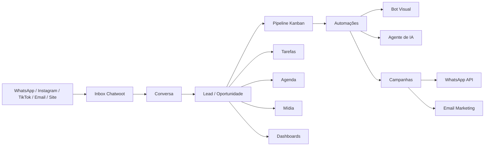

# Projeto de Melhorias do Fork do Chatwoot

**Base de referência:** mapeamento interno do Kommo, site oficial da Kommo, análise visual dos vídeos enviados pela cliente, PRD técnico informado pelo cliente em 05/05/2026, site oficial da SocialHub e benchmarking do plano SocialHub Master.

**Diretriz central:** todas as melhorias devem ser implementadas **dentro do fork do Chatwoot**, no próprio core do produto. O objetivo não é integrar Kommo ou SocialHub como dependência, mas usar essas plataformas como referência de produto, UX, CRM e automação.

**Data de referência da pesquisa e atualização:** 05/05/2026.

**Atualização incorporada:** requisitos operacionais informados pela cliente após assistir aos vídeos do Kommo em 05/05/2026. A nova versão inclui sanitização de leads, busca por telefone, renomeação automática, descarte rápido, arquivamento sem distorcer métricas e padronização da origem do lead.

---

## 1. Objetivo executivo

O fork atual do Chatwoot deve evoluir de uma plataforma de atendimento conversacional para uma plataforma completa de **CRM conversacional**, com:

- atendimento omnichannel;
- CRM com pipeline Kanban;
- detalhes completos de leads;
- tarefas, notas, agendamentos e histórico;
- campanhas de WhatsApp;
- chatbot visual e chatbot com IA;
- automações por etapa do funil;
- email marketing integrado;
- calendário e reservas;
- relatórios de vendas, atendimento e campanhas;
- recursos de segurança, auditoria e LGPD;
- experiência adaptada para operações jurídicas;
- saneamento de leads inválidos, duplicados e genéricos;
- arquivamento correto de clientes que retornam à base;
- origem do lead padronizada para ROI e relatórios;
- redução de cliques na movimentação e descarte de leads.

A proposta é transformar o fork em uma solução semelhante ao conjunto funcional de **Kommo + SocialHub Master**, preservando a autonomia do sistema, a propriedade dos dados e a possibilidade de customização profunda.

---

## 2. Fontes e referências usadas

### 2.1 Kommo

- Site oficial da Kommo Brasil: CRM baseado em mensagens com IA, gestão de chat, gestão de funil e gestão de reservas.
- Página oficial do Salesbot: bots sem código, mensagens multimídia, gatilhos, ações de fluxo, tarefas e movimentação de clientes pelo pipeline.
- Mapeamento direto do ambiente Kommo do escritório Coimbra & Ruas Advocacia.
- Vídeos enviados pela cliente mostrando telas de funil, cartões de lead, histórico e ficha detalhada.
- Documento de colocações da cliente sobre os vídeos do Kommo, com diagnóstico de busca por telefone, cards genéricos, renomeação manual, tarefas contextuais, descarte de leads inválidos, reingresso de clientes e origem estruturada.

### 2.2 SocialHub

- Site oficial da SocialHub.
- Página de preços da SocialHub.
- Página do CRM para WhatsApp.
- Página de chatbot para WhatsApp com IA.
- Página de notificações/campanhas de WhatsApp.
- Página de múltiplos atendentes.
- Página de email marketing com IA.
- Página sobre a empresa SocialHub.

### 2.3 Chatwoot

- Documentação e páginas oficiais do Chatwoot sobre canais, inbox, automações, atributos personalizados e recursos gerais.

---

## 3. Benchmark do Kommo

### 3.1 Recursos observados no ambiente Kommo

O Kommo apresenta uma experiência de CRM focada em vendas por mensagens. Os principais módulos mapeados foram:

#### Funis de vendas

- Vários funis independentes.
- Exemplo observado: **Funil de Vendas**.
- Exemplo observado: **Enviar Proposta**.
- Visualização Kanban por etapas.
- Cartões de leads com última mensagem, horário, canal, responsável e estágio.
- Botão **+ Lead** para criação rápida.
- Botão **Automatize** para automações do pipeline.
- Filtro de leads ativos.
- Busca e contagem de leads por funil.
- Valor total das oportunidades.

#### Lista de leads

- Visão tabular de todos os leads.
- Colunas como título, contato principal, empresa, etapa do lead e valor.
- Ações rápidas por linha.
- Melhor para triagem, filtros e operações em massa.

#### Comunicação

- Inbox de chat.
- Inbox de email.
- Chats da equipe.
- Integrações fixadas com WhatsApp Business, Instagram e TikTok.
- Histórico de mensagens dentro do lead.

#### Calendário

- Visão diária, semanal e mensal.
- Eventos associados a leads.
- Sincronização de agenda.
- Criação de novo evento.
- Lembretes e acompanhamento.

#### Contatos, empresas e mídia

- Lista de contatos.
- Lista de empresas.
- Visão combinada de contatos e empresas.
- Repositório de mídia e arquivos vinculados a leads.

#### Automação e IA

- Automação por etapa do funil.
- Salesbot para fluxos automáticos.
- Agente de IA para responder, qualificar e conduzir leads.
- Ações automáticas como criar tarefas, enviar mensagens e mover etapas.

---

## 4. Requisitos extraídos dos vídeos e das colocações da cliente

Esta seção consolida o que foi observado nos vídeos da cliente e, principalmente, as colocações técnicas fornecidas após a análise do Kommo. O foco é transformar as dores reais da operação do escritório **Coimbra & Ruas Advocacia** em requisitos de produto para o fork do Chatwoot.

### 4.1 Contexto operacional

O fluxo observado no Kommo é usado para triagem de leads jurídicos provenientes de WhatsApp e portais como **JusBrasil**. A operação precisa localizar, higienizar, qualificar, descartar, arquivar e mover leads entre etapas com o menor número possível de cliques.

A dor principal não é apenas “ter um Kanban”. A necessidade real é criar um processo de CRM conversacional que organize leads jurídicos vindos de mensagens, evite sujeira operacional e gere relatórios confiáveis sobre origem, conversão e tempo de movimentação.

### 4.2 Diagnóstico do fluxo atual observado no Kommo

#### Busca e recuperação por telefone

A cliente usa a busca global por telefone, por exemplo `84612798`, para localizar registros. Isso indica que muitos cards entram no funil com nomes genéricos, IDs, usernames ou identificadores pouco legíveis.

**Requisito para o fork:** o sistema precisa ter busca forte por telefone, mas também precisa reduzir a necessidade dessa busca. O card deve ser legível, com nome normalizado, telefone, canal, origem e alerta quando o nome ainda for genérico.

#### Cards com nomes genéricos ou pouco humanos

Foi identificada a necessidade recorrente de renomear leads, como transformar `eneida547` em `Eneida`. Isso mostra que a criação automática de lead precisa trazer o melhor nome possível do perfil do WhatsApp, Instagram, formulário ou portal de origem.

**Requisito para o fork:** criar uma camada de sanitização e normalização de nome do lead, com sugestão automática e edição rápida.

#### Movimento de etapa com muitos cliques

A transição de estado, como `Entrada` para `Negociação`, é feita via modal no Kommo. Isso garante alteração correta dos metadados, mas exige muitos cliques e desacelera a triagem.

**Requisito para o fork:** permitir movimentação por drag-and-drop, ação rápida no card e atalhos de teclado, mantendo logs e validações obrigatórias.

#### Tarefas contextuais dentro do atendimento

O Kommo permite agendar tarefas diretamente na aba de chat, por exemplo “ligar às 17:00”. Isso reduz troca de contexto para o advogado ou atendente.

**Requisito para o fork:** a conversa do Chatwoot deve permitir criar tarefa, nota e agendamento sem sair da tela do atendimento.

### 4.3 Pontos de fricção identificados

| Fricção | Impacto | Requisito P0 |
|---|---|---|
| Leads inválidos | Funil poluído | Descarte em massa |
| Cards genéricos | Busca manual | Nome automático |
| Cliente retornando | Métrica distorcida | Cliente Base |
| Origem em texto livre | ROI impreciso | Dropdown de origem |
| Modal para mover etapa | Mais cliques | Ação rápida |
| Tarefa fora de fluxo | Context switching | Tarefa no chat |

### 4.4 Requisitos funcionais adicionados ao projeto

#### RF-01 — Sanitização automática de nome do lead

Ao criar um lead a partir de uma conversa, o sistema deve tentar preencher o nome usando fontes em ordem de confiança:

1. nome do perfil do WhatsApp Business;
2. nome do formulário ou portal;
3. nome extraído da primeira mensagem;
4. nome salvo no contato existente;
5. telefone formatado como fallback.

O sistema deve marcar como **nome genérico** quando detectar padrões como ID, username, número solto, `lead #`, apelidos automáticos ou strings sem legibilidade humana.

#### RF-02 — Edição rápida do nome no card

O card do Kanban deve permitir renomeação inline. O usuário não deve precisar abrir a ficha completa do lead para trocar `eneida547` por `Eneida`.

#### RF-03 — Busca robusta por telefone

A busca deve encontrar contatos e leads mesmo quando o telefone for digitado em formatos diferentes:

- com ou sem DDI;
- com ou sem DDD;
- com espaços;
- com hífen;
- com parênteses;
- com últimos 8 ou 9 dígitos.

#### RF-04 — Ações em massa no Kanban e na lista

O sistema deve permitir selecionar vários leads e executar ações em lote:

- arquivar;
- marcar como spam;
- excluir logicamente;
- mover etapa;
- atribuir responsável;
- aplicar tag;
- alterar origem;
- adicionar à campanha;
- exportar.

#### RF-05 — Descarte rápido no card

Cada card deve ter botão rápido de **Spam/Lixeira**. A ação deve pedir confirmação leve e registrar motivo.

Motivos sugeridos:

- spam;
- contato inválido;
- número errado;
- teste;
- duplicado;
- fora do perfil;
- sem interesse;
- atendimento já concluído.

#### RF-06 — Arquivamento por conversão / Cliente Base

Clientes antigos que retornam não devem ser simplesmente excluídos. A exclusão distorce métricas de conversão e apaga histórico útil.

Criar status específicos:

- **Cliente Base**;
- **Cliente Convertido**;
- **Retorno de Cliente**;
- **Arquivado por Conclusão**;
- **Arquivado sem Conversão**;
- **Duplicado**;
- **Spam**.

#### RF-07 — Origem estruturada do lead

O campo “Origem do Lead” não deve ser texto livre. Ele deve ser um dropdown configurável, com opções padronizadas.

Opções iniciais:

- JusBrasil;
- WhatsApp direto;
- Instagram;
- Facebook;
- Google Ads;
- Meta Ads;
- Indicação;
- Site;
- Email;
- TikTok;
- Cliente Base;
- Outro.

O campo deve aceitar `source_detail` para informações complementares, como campanha, anúncio, URL, palavra-chave ou observação.

#### RF-08 — Dashboard de performance da triagem

Criar relatório comparando volume de entrada com movimentação para a etapa **Negociação**.

Indicadores mínimos:

- leads novos por dia;
- leads inválidos descartados;
- leads renomeados manualmente;
- tempo médio até triagem;
- tempo médio até negociação;
- taxa de conversão por origem;
- retorno de clientes antigos;
- leads parados na entrada;
- tarefas criadas por etapa.

### 4.5 Ajustes no MVP a partir da cliente

A partir das colocações da cliente, alguns itens passam a ser prioridade **P0** na primeira entrega:

- bulk actions para limpar leads inválidos;
- botão Spam/Lixeira no card;
- renomeação inline;
- normalização do nome vindo do WhatsApp;
- busca por telefone normalizado;
- status Cliente Base;
- origem do lead por dropdown;
- tarefa contextual dentro da conversa;
- relatório Entrada → Negociação.

### 4.6 Implicação para o fork do Chatwoot

O fork não deve apenas copiar o visual do Kommo. Ele precisa resolver a operação real da cliente com menos cliques e dados mais confiáveis. A implementação deve priorizar saneamento de cadastro, clareza dos cards, arquivamento correto e relatórios de origem antes de avançar para recursos mais complexos de IA e campanhas.

## 5. Benchmark da SocialHub Master

### 5.1 Posicionamento da SocialHub

A SocialHub se posiciona como plataforma brasileira de CRM, chatbot, automação de WhatsApp e email marketing. O foco é centralizar atendimento e vendas em uma solução única, voltada para PMEs brasileiras.

A página oficial apresenta a SocialHub como uma plataforma que unifica:

- atendimento via WhatsApp;
- CRM de vendas;
- chatbot com inteligência artificial;
- email marketing;
- integrações com ERPs e plataformas nacionais;
- relatórios de vendas, atendimento e campanhas.

### 5.2 Recursos principais observados

#### CRM para WhatsApp

- Pipeline visual.
- Funis personalizados.
- Captura automática de leads do WhatsApp.
- Follow-up via WhatsApp e Gmail.
- Distribuição automática entre vendedores.
- Relatórios de conversão.
- Campos personalizados.
- Tags e segmentação.
- Prospecção por CNPJ.

#### Chatbot com IA

- Atendimento automático 24/7.
- Fluxos visuais sem programação.
- Botões e menus interativos.
- Condições e ramificações.
- IA que entende linguagem natural.
- Respostas contextualizadas.
- Treinamento com base de conhecimento.
- Qualificação automática de leads.
- Envio do lead para CRM com tags.
- Score por respostas.
- Transferência para humano com contexto.
- Agendamento inteligente com Google Agenda.

#### Campanhas e notificações de WhatsApp

- Campanhas de texto, áudio, vídeo e arquivos.
- API oficial e conexão via QR Code.
- Rotação inteligente de números.
- Rotação de templates.
- Importação por CSV/XLSX.
- Cadências automáticas.
- Condições: se leu, se respondeu, se não abriu.
- Relatórios de envio, entrega, leitura e resposta.
- Exportação de relatórios.

#### Múltiplos atendentes

- Vários atendentes simultâneos.
- Múltiplos números de WhatsApp.
- Departamentos.
- Transferência de conversas.
- Distribuição automática.
- Regras por tag ou origem.
- Fila de espera.
- Monitoramento em tempo real.
- Relatórios de desempenho.

#### Email marketing

- Criação de emails com IA.
- Templates prontos.
- Importação de HTML.
- Envio por domínio próprio.
- SPF, DKIM e DMARC.
- Cadências de email pelo CRM.
- Integração com Gmail.

#### Integrações

- ERPs brasileiros.
- E-commerce.
- Meios de pagamento.
- Logística.
- API aberta.
- Webhooks.

### 5.3 Plano SocialHub Master como referência funcional

A página de preços consultada apresenta o plano **Master** como referência para operações robustas.

Recursos listados no plano Master:

| Item | Referência Master |
|---|---:|
| Preço | R$399/mês |
| Usuários | 5 |
| WhatsApp | 3 números |
| Pipeline visual | Sim |
| Chatbot | IA avançada |
| Notificações | 15 mil/mês |
| Envios ERP | 500/mês |
| API | 1.000 req/mês |
| Email | Marketing + Gmail |

A mesma página também menciona recursos como contatos ilimitados, conversas simultâneas ilimitadas, funis personalizados, campos personalizados, tags, chatbot com fluxos visuais, chatbot com IA, IA avançada e agendamento Google Agenda/Meet.

> Observação: outras páginas segmentadas da SocialHub mencionam variações como 5 números de WhatsApp e 5 pipelines. Para este projeto, a referência principal deve ser a página atual de preços, por ser a fonte comercial mais direta.

---

## 6. O que o Chatwoot já cobre e o que precisa evoluir

O Chatwoot já é uma boa base para atendimento omnichannel. Ele oferece canais como live chat, email, WhatsApp, Facebook Messenger, Instagram, TikTok, Telegram, LINE, SMS, inbox compartilhado e automações. Porém, para competir com Kommo e SocialHub no contexto de vendas por mensagem, o fork precisa evoluir em CRM, pipeline, automação comercial, campanhas e IA.

### 6.1 Recursos que já existem ou podem ser reaproveitados

- Contatos.
- Conversas.
- Caixas de entrada.
- Agentes.
- Times.
- Labels/tags.
- Atributos personalizados.
- Macros.
- Regras de automação.
- Webhooks.
- API.
- Relatórios de atendimento.
- Anexos.
- Mensagens internas.

### 6.2 Lacunas atuais para uso comercial

- Pipeline Kanban nativo.
- Entidade de oportunidade/negócio.
- Ficha comercial do lead.
- Múltiplos funis comerciais.
- Valor de venda por lead.
- Etapas personalizadas por funil.
- Tarefas e agenda integradas ao lead.
- Automação por etapa de funil.
- Bot visual conectado ao CRM.
- Agente de IA com ações comerciais.
- Campanhas de WhatsApp com cadência.
- Email marketing integrado.
- Prospecção estruturada.
- Relatórios de conversão e receita.
- Histórico comercial 360º.

---

## 7. Visão do produto para o fork

O fork deve se tornar um **CRM conversacional nativo**, com o Chatwoot como base de atendimento e uma camada de CRM implementada diretamente no core.

### 7.1 Nome interno sugerido

**Chatwoot CRM Core**

### 7.2 Princípios de implementação

- Implementar dentro do core do fork.
- Não depender de Kommo ou SocialHub.
- Não construir apenas uma integração superficial.
- Reaproveitar entidades já existentes quando fizer sentido.
- Criar novos domínios para CRM, campanhas, tarefas, eventos e IA.
- Manter compatibilidade com multi-account.
- Criar feature flags por módulo.
- Registrar auditoria em ações sensíveis.
- Garantir LGPD e sigilo profissional.
- Manter API documentada.

### 7.3 Módulos-alvo

1. CRM Pipeline.
2. Oportunidades/Leads.
3. Ficha 360º do lead.
4. Tarefas, notas e agenda.
5. Inbox omnichannel com lead sidebar.
6. Automação de pipeline.
7. Bot visual.
8. Agente de IA.
9. Campanhas de WhatsApp.
10. Email marketing.
11. Biblioteca de mídia.
12. Integrações e webhooks.
13. Relatórios comerciais.
14. Segurança, auditoria e LGPD.

---

## 8. Arquitetura funcional proposta



---

## 9. Modelo de dados sugerido

A modelagem deve respeitar a estrutura multi-account do Chatwoot. Todas as novas tabelas precisam conter `account_id` e trilhas de auditoria.

### 9.1 Entidades principais

```text
crm_pipelines
crm_pipeline_stages
crm_opportunities
crm_opportunity_contacts
crm_companies
crm_tasks
crm_events
crm_notes
crm_activity_logs
crm_media_assets
crm_lead_sources
crm_archive_reasons
crm_bulk_operations
crm_duplicate_links
crm_campaigns
crm_campaign_steps
crm_campaign_recipients
crm_bot_flows
crm_bot_nodes
crm_ai_agents
crm_ai_knowledge_sources
crm_score_rules
crm_integrations
```

### 9.2 `crm_pipelines`

Campos sugeridos:

```text
id
account_id
name
slug
description
position
status
created_by_id
created_at
updated_at
```

Exemplos:

- Funil de Vendas.
- Enviar Proposta.
- Pós-atendimento.
- Recuperação de Leads.

### 9.3 `crm_pipeline_stages`

Campos sugeridos:

```text
id
account_id
pipeline_id
name
position
color
sla_minutes
is_won
is_lost
created_at
updated_at
```

Exemplo jurídico:

- Novo lead.
- Triagem.
- Atendimento inicial.
- Documentos solicitados.
- Proposta enviada.
- Negociação.
- Contrato enviado.
- Fechado.
- Perdido.

### 9.4 `crm_opportunities`

Campos sugeridos:

```text
id
account_id
pipeline_id
stage_id
conversation_id
primary_contact_id
company_id
owner_id
title
amount_cents
currency
source_id
source
source_detail
origin_url
raw_profile_name
normalized_name
is_name_generic
status
archive_reason_id
priority
score
last_interaction_at
next_follow_up_at
closed_at
lost_reason
custom_attributes
created_at
updated_at
```

Campos críticos para o escritório:

- origem: JusBrasil, Instagram, indicação, site, Google Ads, Meta Ads;
- serviço jurídico de interesse;
- área do direito;
- urgência;
- data de prazo;
- responsável interno;
- valor estimado;
- etapa processual/comercial;
- status documental.


### 9.4.1 Campos adicionais exigidos pela auditoria da cliente

A auditoria do fluxo do Kommo mostrou que a operação precisa de campos específicos para legibilidade, descarte e preservação de métricas.

Adicionar ou prever em `crm_opportunities`:

```text
raw_title
normalized_title
display_name_source
whatsapp_profile_name
normalized_phone
lead_source_id
source_confidence
source_detail
source_url
source_campaign_id
archive_status
archive_reason
archived_at
archived_by_id
discard_status
discard_reason
discarded_at
discarded_by_id
is_base_client
base_client_since
reentry_count
last_reentry_at
previous_opportunity_id
conversion_preserved
validation_status
```

Uso dos campos:

- `raw_title`: título original recebido do canal.
- `normalized_title`: título limpo sugerido pelo sistema.
- `display_name_source`: origem do nome exibido no card.
- `normalized_phone`: telefone padronizado para busca.
- `lead_source_id`: origem estruturada.
- `archive_status`: status de arquivamento.
- `discard_reason`: motivo do descarte.
- `is_base_client`: identifica cliente já convertido.
- `reentry_count`: mede retorno de cliente antigo.
- `conversion_preserved`: evita distorção de métricas.

### 9.4.2 Tabela de origens estruturadas

Criar tabela própria para origens, evitando texto livre.

```text
crm_lead_sources
```

Campos sugeridos:

```text
id
account_id
name
slug
category
is_active
is_default
created_at
updated_at
```

Categorias sugeridas:

- portal jurídico;
- mensageria;
- social ads;
- indicação;
- site;
- email;
- cliente base;
- outro.

### 9.4.3 Tabela de motivos de descarte e arquivamento

Criar tabela configurável para padronizar motivos.

```text
crm_disposition_reasons
```

Campos sugeridos:

```text
id
account_id
name
slug
reason_type
is_active
requires_note
created_at
updated_at
```

Tipos de motivo:

- spam;
- inválido;
- duplicado;
- sem interesse;
- cliente base;
- convertido;
- fora do perfil;
- perdido.

Motivos devem aparecer no card, na lista de leads e na ficha 360º.

### 9.5 `crm_tasks`

Campos sugeridos:

```text
id
account_id
opportunity_id
conversation_id
assigned_to_id
title
description
due_at
status
priority
task_type
created_by_id
completed_at
created_at
updated_at
```

Tipos:

- ligação;
- WhatsApp;
- email;
- enviar documento;
- revisar proposta;
- audiência;
- prazo jurídico;
- follow-up.

### 9.6 `crm_events`

Campos sugeridos:

```text
id
account_id
opportunity_id
contact_id
assigned_to_id
title
description
starts_at
ends_at
location
meeting_url
provider
provider_event_id
status
created_at
updated_at
```

Integrações futuras:

- Google Calendar;
- Google Meet;
- Outlook;
- agenda interna;
- webhooks para sistemas jurídicos.

### 9.7 `crm_activity_logs`

Registrar:

- criação de lead;
- mudança de etapa;
- mudança de responsável;
- alteração de valor;
- nova nota;
- nova tarefa;
- tarefa concluída;
- campanha enviada;
- bot acionado;
- IA respondeu;
- contato atualizado;
- arquivo anexado.

### 9.8 `crm_lead_sources`

A origem deve ser estruturada para evitar relatórios quebrados por texto livre.

Campos sugeridos:

```text
id
account_id
name
slug
channel
is_active
position
created_at
updated_at
```

Exemplos iniciais:

- JusBrasil;
- WhatsApp direto;
- Instagram;
- Indicação;
- Site;
- Google Ads;
- Meta Ads;
- Cliente Base.

### 9.9 `crm_archive_reasons`

Campos sugeridos:

```text
id
account_id
name
slug
kind
is_active
created_at
updated_at
```

Tipos de motivo:

- spam;
- duplicado;
- inválido;
- sem interesse;
- cliente convertido;
- cliente base;
- fora do perfil;
- número errado.

### 9.10 `crm_bulk_operations`

Registrar operações em massa para auditoria e rastreabilidade.

Campos sugeridos:

```text
id
account_id
operation_type
status
selected_ids
filters_snapshot
requested_by_id
processed_count
failed_count
started_at
finished_at
created_at
updated_at
```

Operações previstas:

- arquivar;
- marcar como spam;
- mover etapa;
- alterar responsável;
- aplicar tag;
- alterar origem;
- exportar.

### 9.11 `crm_campaigns`

Campos sugeridos:

```text
id
account_id
name
channel
status
audience_filter
scheduled_at
created_by_id
template_id
cadence_enabled
created_at
updated_at
```

Canais:

- WhatsApp;
- email;
- SMS;
- multicanal.

### 9.12 `crm_campaign_steps`

Campos sugeridos:

```text
id
account_id
campaign_id
position
channel
delay_value
delay_unit
condition_type
message_template
media_asset_id
next_stage_id
created_at
updated_at
```

Condições:

- se respondeu;
- se não respondeu;
- se leu;
- se não abriu;
- se clicou;
- se entrou no funil;
- se mudou de etapa.

---

## 10. UX e telas propostas

### 10.1 Menu lateral

Adicionar grupo principal:

```text
CRM
├── Funis
├── Todos os leads
├── Contatos
├── Empresas
├── Tarefas
├── Agenda
├── Campanhas
├── Bots
├── IA
├── Relatórios
└── Configurações CRM
```

### 10.2 Kanban de funil

Funcionalidades:

- colunas por etapa;
- arrastar e soltar;
- contagem por etapa;
- soma de valor por etapa;
- filtros por responsável;
- filtros por origem;
- filtros por canal;
- busca global;
- criação rápida;
- automações por etapa;
- configuração do funil;
- alternância Kanban/lista.

Cartão do lead:

- nome;
- canal;
- origem;
- última mensagem;
- responsável;
- horário;
- valor;
- tarefa pendente;
- indicador de SLA;
- tags.

Ações rápidas no cartão:

- abrir conversa;
- criar tarefa;
- criar nota;
- agendar;
- mover etapa;
- renomear inline;
- alterar origem;
- marcar ganho;
- marcar perdido;
- marcar Cliente Base;
- enviar para Spam/Lixeira;
- selecionar para ação em massa.

### 10.3 Higienização e ações em massa

Criar uma camada de UX própria para saneamento do funil.

Funcionalidades:

- checkbox em cada card;
- seleção por etapa;
- seleção por filtro;
- ação em massa;
- botão Spam/Lixeira;
- motivo de arquivamento;
- desfazer por tempo curto;
- log de auditoria;
- contador de itens afetados.

Fluxo recomendado:

```text
Selecionar leads → escolher ação → confirmar motivo → processar em background → exibir resumo
```

Casos de uso:

- limpar leads que não são leads;
- remover testes;
- arquivar duplicados;
- marcar clientes que retornaram;
- corrigir origem em lote.

### 10.4 Ficha 360º do lead

Abas propostas:

```text
Principal
Conversas
Notas
Tarefas
Agenda
Arquivos
Campanhas
Estatísticas
Auditoria
```

Campos no topo:

- título do lead;
- etapa atual;
- pipeline;
- responsável;
- valor;
- status;
- score;
- prioridade.

Campos principais:

- contato principal;
- telefone;
- email;
- empresa;
- origem;
- serviço de interesse;
- área jurídica;
- observações;
- documentos necessários;
- próxima ação;
- data do próximo follow-up.

### 10.5 Sidebar de CRM dentro da conversa

A conversa do Chatwoot deve ganhar um painel lateral com:

- lead vinculado;
- etapa atual;
- valor;
- responsável;
- origem;
- tarefas pendentes;
- próximas ações;
- botão criar lead;
- botão vincular lead existente;
- botão criar tarefa;
- botão agendar;
- botão criar nota.

### 10.6 Composer com ações rápidas

Inspirado no menu visualizado no vídeo:

```text
+ Ação
├── Bate-papo
├── Nota
├── Tarefa
├── Agendamento
├── Arquivo
├── Modelo
└── Proposta
```

Essa melhoria reduz troca de tela e aproxima o fluxo do operador da experiência do Kommo.


### 10.6 UX específica para sanitização e operação rápida

A experiência do Kanban deve minimizar cliques e reduzir trabalho administrativo.

#### Busca global reforçada

A busca deve localizar leads por:

- telefone completo;
- últimos dígitos do telefone;
- nome limpo;
- nome original;
- email;
- ID do lead;
- origem;
- empresa;
- tags.

Exemplo:

```text
Busca: 84612798
Resultado: lead vinculado ao telefone +55 61 84612-798
```

#### Auto-nome no card

Ao criar ou atualizar lead, o sistema deve escolher o melhor nome disponível:

1. nome do perfil WhatsApp;
2. nome salvo no contato;
3. nome extraído da mensagem inicial;
4. telefone formatado;
5. ID técnico como fallback.

O card deve mostrar a fonte do nome quando houver baixa confiança.

Exemplo:

```text
Eneida
Fonte: WhatsApp profile
Confiança: alta
```

#### Ações rápidas de purga

Adicionar botões no card e na lista:

- spam;
- arquivar;
- cliente base;
- perdido;
- excluir.

A exclusão deve exigir permissão elevada. O arquivamento deve ser preferido sempre que houver histórico útil.

#### Bulk actions

Permitir seleção de vários leads e execução de ações em massa:

- alterar responsável;
- alterar etapa;
- marcar spam;
- arquivar;
- marcar cliente base;
- aplicar origem;
- aplicar tag;
- criar tarefa;
- exportar;
- excluir com permissão.

Toda ação em massa deve registrar auditoria.

#### Arquivamento sem perda de métricas

O sistema deve separar:

- lead perdido;
- lead inválido;
- lead spam;
- cliente convertido;
- cliente da base;
- cliente reativado.

Isso evita que exclusões distorçam conversão, histórico e performance por origem.

---

## 11. Automação de pipeline

### 11.1 Motor de regras

Criar automações com lógica:

```text
QUANDO algo acontecer
SE condições forem verdadeiras
ENTÃO execute ações
```

Eventos:

- conversa criada;
- lead criado;
- lead mudou de etapa;
- mensagem recebida;
- mensagem sem resposta;
- tarefa vencida;
- contato sem interação;
- campanha respondida;
- formulário preenchido;
- origem identificada.

Condições:

- canal;
- origem;
- tag;
- etapa;
- responsável;
- horário;
- score;
- valor;
- campo personalizado;
- palavras-chave.

Ações:

- atribuir responsável;
- mover etapa;
- adicionar tag;
- criar tarefa;
- enviar mensagem;
- iniciar bot;
- enviar email;
- adicionar em campanha;
- notificar gestor;
- criar evento;
- chamar webhook;
- atualizar atributo.

### 11.2 Automações de saneamento de lead

As automações devem reduzir retrabalho na triagem inicial.

Automações P0:

- puxar nome do perfil do WhatsApp;
- detectar nome genérico;
- sugerir nome extraído da conversa;
- normalizar telefone;
- identificar duplicidade por telefone;
- detectar cliente antigo;
- marcar como Cliente Base;
- preencher origem por canal, UTM ou integração;
- criar tarefa de retorno quando cliente antigo reaparece;
- alertar gestor sobre alto volume de leads inválidos.

Exemplo:

```text
Quando conversa chega pelo WhatsApp:
- normalizar telefone;
- buscar contato existente;
- se já houver cliente fechado, criar lead como Retorno de Cliente;
- preencher origem como WhatsApp direto;
- usar nome do perfil como sugestão;
- se nome parecer genérico, exibir alerta no card.
```

### 11.3 Automação por etapa

Cada etapa do pipeline deve permitir:

- ações ao entrar;
- ações ao sair;
- SLA da etapa;
- alertas de inatividade;
- tarefas automáticas;
- campanha automática;
- bot automático;
- bloqueios de avanço sem campos obrigatórios.

Exemplo jurídico:

```text
Quando lead entra em "Documentos solicitados":
- enviar mensagem com checklist;
- criar tarefa para conferir documentos;
- definir prazo de 24h;
- se não responder em 2 dias, disparar follow-up.
```


### 11.3 Automações específicas da auditoria da cliente

#### Nome automático do lead

Evento:

```text
Conversa criada via WhatsApp
```

Ações:

- buscar nome do perfil;
- normalizar nome;
- atualizar título do lead;
- registrar fonte do nome;
- marcar baixa confiança quando houver ID ou apelido.

#### Origem automática

Evento:

```text
Lead criado por canal ou URL rastreada
```

Ações:

- preencher origem estruturada;
- capturar URL de origem;
- capturar campanha;
- aplicar tag de origem;
- registrar no histórico.

#### Tratamento de cliente antigo

Evento:

```text
Novo contato com telefone já existente
```

Ações:

- localizar histórico anterior;
- sugerir reabertura;
- marcar como cliente base;
- preservar conversão antiga;
- criar nova oportunidade se houver novo caso.

#### Purga assistida

Evento:

```text
Lead marcado como spam ou inválido
```

Ações:

- remover do Kanban ativo;
- registrar motivo;
- manter log;
- atualizar dashboard de descarte;
- impedir entrada em campanhas.

---

## 12. Bot visual e agente de IA

### 12.1 Bot visual

Criar editor drag-and-drop com blocos:

- mensagem;
- pergunta;
- botão;
- condição;
- capturar dado;
- atualizar lead;
- criar tarefa;
- mover etapa;
- enviar arquivo;
- transferir para humano;
- chamar webhook;
- esperar tempo;
- encerrar fluxo.

### 12.2 Bot com IA

O bot com IA deve:

- interpretar linguagem natural;
- responder perguntas frequentes;
- qualificar leads;
- coletar dados estruturados;
- aplicar score;
- sugerir próxima etapa;
- transferir para humano;
- resumir conversa;
- sugerir resposta para operador;
- registrar notas automáticas;
- gerar tarefas de follow-up;
- identificar urgência.

### 12.3 Base de conhecimento

Criar área para treinar a IA com:

- perguntas frequentes;
- serviços jurídicos;
- políticas do escritório;
- valores de consulta;
- modelos de resposta;
- documentos necessários;
- tom de comunicação;
- regras de triagem.

### 12.4 Guardrails para advocacia

Como se trata de escritório jurídico, a IA deve ter limites:

- não prometer resultado judicial;
- não fornecer aconselhamento jurídico definitivo sem humano;
- não inventar prazos ou valores;
- não coletar dados excessivos;
- encaminhar temas sensíveis para advogado;
- registrar quando resposta foi gerada por IA;
- permitir aprovação humana antes do envio.

---

## 13. Campanhas de WhatsApp e cadências

### 13.1 Campanhas

Funcionalidades:

- importar contatos por CSV/XLSX;
- segmentar por tags, origem, etapa e campos;
- usar templates aprovados;
- enviar texto, imagem, áudio, vídeo e PDF;
- agendar data e horário;
- acompanhar envio, entrega, leitura e resposta;
- exportar relatório.

### 13.2 Cadências

Criar sequências de mensagens:

```text
Dia 0: primeira abordagem
Dia 2: follow-up
Dia 5: lembrete
Dia 7: última tentativa
```

Condições:

- se respondeu: mover para etapa X;
- se não respondeu: próxima mensagem;
- se leu e não respondeu: criar tarefa;
- se clicou: aumentar score;
- se pediu atendimento: atribuir responsável.

### 13.3 Cuidados de compliance

- consentimento de contato;
- opt-out;
- lista de bloqueio;
- limite por número;
- logs de envio;
- controle de templates;
- respeito às políticas da Meta;
- trilha de auditoria.

---

## 14. Email marketing integrado

### 14.1 Editor de email

Recursos:

- editor visual;
- criação com IA;
- templates prontos;
- importação HTML;
- variáveis de personalização;
- pré-visualização;
- teste de envio;
- anexos;
- links rastreáveis.

### 14.2 Infraestrutura de envio

- SMTP próprio;
- domínio próprio;
- SPF;
- DKIM;
- DMARC;
- bounce handling;
- unsubscribe;
- tracking de abertura;
- tracking de clique.

### 14.3 Integração com CRM

- enviar email por etapa;
- nutrir leads frios;
- disparar sequência pós-consulta;
- enviar documentos ou propostas;
- acompanhar engajamento no lead;
- criar tarefa se o lead clicar.

---

## 15. Agenda, reservas e tarefas

### 15.1 Agenda interna

Funcionalidades:

- visão diária;
- visão semanal;
- visão mensal;
- eventos por responsável;
- eventos por lead;
- integração com tarefas;
- alertas;
- lembretes;
- filtros.

### 15.2 Agendamento inteligente

Fluxo desejado:

1. Cliente pede reunião.
2. IA consulta disponibilidade.
3. Sistema sugere horários.
4. Cliente escolhe horário.
5. Sistema cria evento.
6. Sistema envia confirmação.
7. Sistema atualiza lead.
8. Sistema cria lembrete.

### 15.3 Aplicação jurídica

Tipos de evento:

- consulta inicial;
- reunião de proposta;
- reunião de documentos;
- audiência;
- prazo processual;
- retorno ao cliente;
- assinatura de contrato.

---

## 16. Relatórios e analytics

### 16.1 Dashboard comercial

Indicadores:

- leads por origem;
- leads por etapa;
- taxa de conversão;
- valor em aberto;
- valor ganho;
- tempo médio por etapa;
- leads sem resposta;
- tarefas vencidas;
- ranking de responsáveis;
- volume Entrada → Negociação;
- tempo médio Entrada → Negociação;
- leads descartados por motivo;
- taxa de clientes retornantes;
- leads com nome genérico;
- taxa de renomeação manual.

### 16.2 Dashboard de atendimento

Indicadores:

- tempo médio de primeira resposta;
- tempo médio de resolução;
- conversas por canal;
- conversas por agente;
- SLA vencido;
- satisfação;
- volume por dia.

### 16.3 Dashboard de campanha

Indicadores:

- mensagens enviadas;
- entregues;
- lidas;
- respondidas;
- opt-out;
- conversão em lead;
- conversão em proposta;
- conversão em contrato.

### 16.4 Dashboard de IA

Indicadores:

- interações resolvidas pela IA;
- transferências para humano;
- intents mais comuns;
- taxa de satisfação;
- erros de resposta;
- respostas aprovadas;
- respostas rejeitadas.


### 16.5 Dashboard de triagem, origem e qualidade da base

Este dashboard atende diretamente às dores apontadas pela cliente.

Indicadores:

- leads novos por dia;
- leads inválidos;
- leads spam;
- leads duplicados;
- clientes da base;
- clientes reativados;
- tempo até primeira ação;
- tempo até negociação;
- conversão por origem;
- descarte por origem;
- responsável com maior fila;
- leads sem nome confiável;
- leads sem origem estruturada.

Filtros:

- origem;
- canal;
- responsável;
- etapa;
- período;
- status de arquivamento;
- motivo de descarte.

Relatórios essenciais:

- entrada versus negociação;
- ROI por origem;
- qualidade da origem;
- clientes novos versus clientes da base;
- tempo médio de triagem por responsável.

---

## 17. Integrações

### 17.1 Integrações prioritárias

- WhatsApp Business API.
- Instagram Direct.
- TikTok Messages.
- Email IMAP/SMTP.
- Google Calendar.
- Google Meet.
- Google Sheets.
- Webhooks genéricos.
- Sistemas jurídicos, se aplicável.
- Plataformas de anúncios.

### 17.2 Integrações brasileiras inspiradas na SocialHub

A SocialHub destaca integrações com ERPs e plataformas brasileiras. Para o fork, a mesma estratégia pode ser aplicada com conectores modulares:

- Bling;
- Tiny;
- ASAAS;
- Conta Azul;
- Nuvemshop;
- PagBank;
- Mercado Pago;
- Correios;
- Monday;
- Hotmart.

Para advocacia, acrescentar:

- JusBrasil;
- Google Ads;
- Meta Ads;
- planilhas internas;
- sistemas de gestão jurídica;
- assinatura eletrônica;
- armazenamento de documentos.

---

## 18. Segurança, auditoria e LGPD

### 18.1 Princípios

- dados centralizados;
- acesso por permissão;
- logs auditáveis;
- consentimento para campanhas;
- retenção configurável;
- exportação de dados;
- exclusão sob solicitação;
- mascaramento de dados sensíveis;
- trilha de alterações.

### 18.2 Permissões sugeridas

Papéis:

- Administrador.
- Gestor comercial.
- Advogado responsável.
- Atendente.
- Financeiro.
- Somente leitura.

Permissões:

- visualizar todos os leads;
- visualizar leads próprios;
- editar etapa;
- editar valor;
- criar campanha;
- aprovar campanha;
- configurar bot;
- configurar IA;
- exportar dados;
- acessar auditoria.

### 18.3 Auditoria obrigatória

Registrar:

- quem viu dados sensíveis;
- quem exportou contatos;
- quem enviou campanha;
- quem alterou lead;
- quem moveu etapa;
- quem deletou registro;
- resposta enviada por IA;
- resposta aprovada por humano.

---

## 19. Roadmap de implementação

### Fase 0 — Auditoria do fork atual

Objetivo: entender o estado real do código.

Entregáveis:

- mapa das alterações já feitas no fork;
- versão base do Chatwoot;
- módulos customizados;
- dependências;
- gaps de segurança;
- plano de branches;
- ambiente de homologação.

### Fase 1 — CRM Core e pipeline

Objetivo: criar base comercial.

Entregáveis:

- tabelas CRM;
- pipeline e etapas;
- oportunidades;
- associação conversa/lead;
- tela Kanban;
- tela lista de leads;
- sidebar de lead na conversa;
- ações rápidas: nota, tarefa e agendamento;
- bulk actions para arquivar/spam/mover leads;
- renomeação inline no card;
- normalização de telefone;
- dropdown estruturado de origem;
- status Cliente Base e Retorno de Cliente.


### Fase 1.1 — Higiene de dados e operação rápida

Objetivo: resolver as dores imediatas confirmadas pela cliente.

Entregáveis:

- busca por telefone normalizado;
- auto-nome por WhatsApp profile;
- origem estruturada por dropdown;
- motivos de descarte;
- status Cliente Base;
- status Arquivado por Conversão;
- status Reaberto;
- ações rápidas no card;
- bulk actions no Kanban;
- bulk actions na lista;
- auditoria de descarte;
- dashboard de triagem inicial.

### Fase 2 — Tarefas, agenda e ficha 360º

Objetivo: reproduzir o núcleo operacional observado no Kommo.

Entregáveis:

- ficha completa do lead;
- abas de lead;
- timeline de atividades;
- tarefas;
- agenda interna;
- lembretes;
- filtros avançados;
- dashboard Entrada → Negociação;
- relatório de descarte por motivo;
- relatório de origem por conversão.

### Fase 3 — Automações de pipeline

Objetivo: automatizar a operação comercial.

Entregáveis:

- motor de eventos;
- condições;
- ações;
- automações por etapa;
- alertas de inatividade;
- criação automática de tarefas;
- mensagens automáticas;
- webhooks.

### Fase 4 — Bot visual e IA

Objetivo: criar camada de atendimento automático.

Entregáveis:

- editor visual de bot;
- blocos de fluxo;
- gatilhos;
- captura de dados;
- integração com CRM;
- sugestões de resposta;
- resumo de conversa;
- qualificação automática;
- score do lead.

### Fase 5 — Campanhas WhatsApp e email marketing

Objetivo: criar recursos inspirados na SocialHub Master.

Entregáveis:

- campanhas WhatsApp;
- importação CSV/XLSX;
- templates;
- cadências;
- condições por resposta/leitura;
- relatórios;
- email marketing;
- editor visual;
- domínio próprio;
- tracking.

### Fase 6 — Relatórios, integrações e escala

Objetivo: consolidar gestão e crescimento.

Entregáveis:

- dashboards de vendas;
- dashboards de atendimento;
- dashboards de campanha;
- dashboards de IA;
- integração com calendário externo;
- conectores brasileiros;
- API pública;
- auditoria avançada;
- otimização de performance.

---

## 20. Priorização do MVP

| Prioridade | Módulo | Motivo |
|---|---|---|
| P0 | Pipeline CRM | Base comercial |
| P0 | Lead sidebar | Uso diário |
| P0 | Tarefas/notas | Demanda da cliente |
| P0 | Ficha 360º | Gestão completa |
| P0 | Busca por telefone | Dor confirmada |
| P0 | Auto-nome | Legibilidade |
| P0 | Origem dropdown | ROI |
| P0 | Bulk actions | Purga |
| P0 | Cliente Base | Métricas |
| P1 | Agenda | Follow-up |
| P1 | Automações | Escala |
| P1 | Relatórios | Gestão |
| P2 | Bot visual | Automação |
| P2 | IA | Qualificação |
| P2 | Campanhas | Crescimento |
| P3 | Email marketing | Nutrição |
| P3 | Integrações BR | Expansão |

---

## 21. Critérios de aceite

### 21.1 Pipeline

- Criar funil.
- Criar etapa.
- Criar lead.
- Mover lead por drag-and-drop.
- Atualizar etapa no backend.
- Registrar log de mudança.
- Aplicar filtros.
- Exibir contagem e valor.

### 21.2 Ficha do lead

- Abrir lead a partir do Kanban.
- Editar responsável.
- Editar valor.
- Editar origem.
- Vincular contato.
- Vincular empresa.
- Criar nota.
- Criar tarefa.
- Criar evento.
- Ver histórico.

### 21.3 Sidebar na conversa

- Criar lead a partir da conversa.
- Vincular conversa a lead existente.
- Mostrar etapa atual.
- Criar tarefa sem sair da conversa.
- Criar nota sem sair da conversa.
- Agendar compromisso.


### 21.3.1 Sanitização, descarte e cliente base

- Buscar lead por telefone parcial.
- Buscar lead por telefone normalizado.
- Sugerir nome limpo automaticamente.
- Atualizar nome do card.
- Selecionar origem por dropdown.
- Bloquear origem livre, se configurado.
- Marcar lead como spam.
- Arquivar lead com motivo.
- Marcar como Cliente Base.
- Reabrir cliente antigo.
- Preservar conversão anterior.
- Selecionar vários leads.
- Executar bulk action.
- Registrar auditoria.
- Refletir descarte no dashboard.

### 21.4 Higienização e descarte

- Detectar nome genérico.
- Sugerir nome do WhatsApp.
- Renomear lead no card.
- Buscar por telefone parcial.
- Selecionar vários leads.
- Arquivar em massa.
- Marcar spam em massa.
- Registrar motivo.
- Permitir desfazer.
- Registrar auditoria.

### 21.5 Origem e Cliente Base

- Criar origem estruturada.
- Editar origem por dropdown.
- Filtrar por origem.
- Gerar relatório por origem.
- Marcar lead como Cliente Base.
- Detectar retorno por telefone.
- Preservar histórico anterior.
- Não distorcer conversão.

### 21.6 Automação

- Criar regra.
- Definir evento.
- Definir condição.
- Definir ação.
- Executar no evento correto.
- Registrar resultado.
- Evitar execução duplicada.

### 21.7 Bot/IA

- Criar fluxo visual.
- Iniciar bot por gatilho.
- Capturar dados.
- Atualizar lead.
- Transferir para humano.
- Sugerir resposta.
- Registrar uso da IA.

### 21.8 Campanhas

- Criar campanha.
- Importar lista.
- Selecionar segmento.
- Agendar envio.
- Enviar mensagem.
- Registrar status.
- Exportar relatório.
- Respeitar opt-out.

---

## 22. Riscos e mitigação

### 22.1 Escopo grande

Mitigação:

- dividir por fases;
- priorizar P0;
- usar feature flags;
- validar com usuários reais.

### 22.2 Complexidade de automações

Mitigação:

- começar com regras simples;
- usar logs claros;
- criar simulador de regra;
- bloquear loops.

### 22.3 Risco em WhatsApp/campanhas

Mitigação:

- usar API oficial quando possível;
- controlar opt-out;
- limitar frequência;
- registrar consentimento;
- validar templates.

### 22.4 Respostas de IA inadequadas

Mitigação:

- revisão humana;
- base de conhecimento controlada;
- limites por área jurídica;
- logs;
- políticas de bloqueio.

### 22.5 Performance do Kanban

Mitigação:

- paginação por etapa;
- lazy loading;
- índices no banco;
- cache de contadores;
- jobs assíncronos.

---

## 23. Backlog técnico sugerido

### Backend

- Criar namespace `Crm`.
- Criar migrations.
- Criar models.
- Criar policies.
- Criar serializers.
- Criar controllers internos.
- Criar API pública.
- Criar jobs de automação.
- Criar serviços de campanha.
- Criar eventos de domínio.
- Criar auditoria.

### Frontend

- Criar rota `/app/accounts/:account_id/crm`.
- Criar Kanban.
- Criar lista de leads.
- Criar ficha do lead.
- Criar sidebar CRM.
- Criar drawer de tarefa.
- Criar modal de agendamento.
- Criar builder de automação.
- Criar builder de bot.
- Criar dashboards.

### Infraestrutura

- Índices no Postgres.
- Filas Sidekiq para automações.
- Filas para campanhas.
- Monitoramento de jobs.
- Logs estruturados.
- Backup de dados.
- Storage de mídia.
- Rate limiting.

---

## 24. Proposta de endpoints

```text
GET    /api/v1/accounts/:account_id/crm/pipelines
POST   /api/v1/accounts/:account_id/crm/pipelines
PATCH  /api/v1/accounts/:account_id/crm/pipelines/:id

GET    /api/v1/accounts/:account_id/crm/opportunities
POST   /api/v1/accounts/:account_id/crm/opportunities
GET    /api/v1/accounts/:account_id/crm/opportunities/:id
PATCH  /api/v1/accounts/:account_id/crm/opportunities/:id
DELETE /api/v1/accounts/:account_id/crm/opportunities/:id

POST   /api/v1/accounts/:account_id/crm/opportunities/bulk_action
POST   /api/v1/accounts/:account_id/crm/opportunities/:id/archive
POST   /api/v1/accounts/:account_id/crm/opportunities/:id/discard
POST   /api/v1/accounts/:account_id/crm/opportunities/:id/mark_base_client
POST   /api/v1/accounts/:account_id/crm/opportunities/:id/reopen

GET    /api/v1/accounts/:account_id/crm/lead_sources
POST   /api/v1/accounts/:account_id/crm/lead_sources
PATCH  /api/v1/accounts/:account_id/crm/lead_sources/:id

GET    /api/v1/accounts/:account_id/crm/disposition_reasons
POST   /api/v1/accounts/:account_id/crm/disposition_reasons
PATCH  /api/v1/accounts/:account_id/crm/disposition_reasons/:id

POST   /api/v1/accounts/:account_id/crm/opportunities/:id/move
POST   /api/v1/accounts/:account_id/crm/opportunities/:id/tasks
POST   /api/v1/accounts/:account_id/crm/opportunities/:id/notes
POST   /api/v1/accounts/:account_id/crm/opportunities/:id/events

GET    /api/v1/accounts/:account_id/crm/campaigns
POST   /api/v1/accounts/:account_id/crm/campaigns
POST   /api/v1/accounts/:account_id/crm/campaigns/:id/schedule
POST   /api/v1/accounts/:account_id/crm/campaigns/:id/cancel

GET    /api/v1/accounts/:account_id/crm/reports/pipeline
GET    /api/v1/accounts/:account_id/crm/reports/campaigns
GET    /api/v1/accounts/:account_id/crm/reports/agents
```

---

## 25. Adaptação para advocacia

### 25.1 Campos recomendados

- Área do direito.
- Tipo de caso.
- Urgência.
- Fonte do lead.
- Número de processo.
- Documentos pendentes.
- Valor estimado.
- Probabilidade de fechamento.
- Responsável jurídico.
- Responsável comercial.
- Próximo prazo.
- Status de contrato.
- Status de honorários.

### 25.2 Funil jurídico sugerido

```text
Novo lead
Triagem inicial
Aguardando documentos
Análise jurídica
Consulta agendada
Proposta enviada
Negociação
Contrato enviado
Cliente fechado
Perdido
```

### 25.3 Automações jurídicas sugeridas

- Novo lead de JusBrasil: criar tarefa de triagem.
- Lead sem resposta por 2h: alertar responsável.
- Consulta agendada: enviar confirmação automática.
- Documentos pendentes: enviar checklist.
- Proposta enviada: follow-up em 24h.
- Contrato enviado: lembrete de assinatura.
- Cliente fechado: criar pasta/registro interno.
- Cliente antigo retorna: marcar como Retorno de Cliente.
- Nome genérico detectado: sugerir renomeação.
- Lead inválido: arquivar com motivo.
- Origem JusBrasil: preencher origem estruturada.

### 25.4 Modelos de mensagem

- saudação inicial;
- pedido de documentos;
- confirmação de reunião;
- lembrete de consulta;
- follow-up de proposta;
- retorno pós-atendimento;
- encerramento com opt-out.

---

## 26. Definição de “pronto” para a primeira entrega

A primeira entrega deve permitir que a equipe:

1. receba uma conversa no Chatwoot;
2. transforme a conversa em lead;
3. veja o lead no Kanban;
4. mova o lead por etapas;
5. edite origem, valor e responsável;
6. crie nota, tarefa e agendamento;
7. veja o histórico do lead;
8. filtre leads por etapa, origem e responsável;
9. acompanhe tarefas pendentes;
10. registre auditoria básica;
11. busque lead por telefone parcial;
12. veja nome limpo no card;
13. descarte spam sem abrir lead;
14. use bulk actions para purga;
15. marque cliente antigo como Cliente Base;
16. use origem estruturada para relatórios.

Essa entrega já resolveria a principal dor visualizada nos vídeos: a falta de um fluxo CRM dentro do atendimento.

---

## 27. PRD complementar — melhorias pedidas pela cliente

### 27.1 Problema de produto

A operação jurídica recebe muitos contatos que entram como leads, mas parte deles é inválida, duplicada, genérica ou pertence a clientes antigos. No fluxo atual, a equipe precisa buscar por telefone, renomear registros, mover etapas por modal e descartar manualmente itens que não deveriam poluir o funil.

### 27.2 Objetivo do incremento

Reduzir tempo de triagem, melhorar legibilidade dos cards e garantir métricas corretas de conversão e origem.

### 27.3 Escopo P0 do incremento

| Item | Resultado esperado |
|---|---|
| Nome automático | Card legível |
| Busca por telefone | Registro localizado |
| Bulk actions | Funil limpo |
| Spam no card | Descarte rápido |
| Cliente Base | Histórico preservado |
| Origem dropdown | ROI confiável |
| Tarefa no chat | Menos troca de tela |
| Relatório E→N | Gestão da triagem |

### 27.4 Histórias de usuário

#### HU-01 — Renomear lead rapidamente

Como atendente, quero editar o nome do lead direto no card, para organizar o funil sem abrir a ficha completa.

Critérios:

- o card exibe ícone de edição;
- a edição salva sem recarregar a página;
- o histórico registra a alteração;
- a busca encontra nome antigo e novo.

#### HU-02 — Descartar leads inválidos em massa

Como gestora, quero selecionar vários leads e marcá-los como spam ou inválidos, para limpar o funil sem abrir um por um.

Critérios:

- seleção múltipla por card e lista;
- escolha de motivo;
- execução assíncrona;
- log de auditoria;
- desfazer em janela curta.

#### HU-03 — Preservar cliente antigo

Como advogada, quero arquivar um cliente antigo como Cliente Base, para preservar histórico sem contar como perda ou novo lead comum.

Critérios:

- status Cliente Base disponível;
- filtro por Cliente Base;
- histórico preservado;
- conversão não distorcida;
- retorno cria nova oportunidade vinculada.

#### HU-04 — Padronizar origem

Como gestora, quero selecionar a origem por dropdown, para gerar relatório confiável de canais como JusBrasil, WhatsApp e indicação.

Critérios:

- origem configurável;
- preenchimento automático por canal;
- edição manual permitida;
- relatório por origem;
- campo de detalhe opcional.

#### HU-05 — Criar tarefa no contexto da conversa

Como atendente, quero criar uma tarefa de ligação dentro da conversa, para não perder o contexto do atendimento.

Critérios:

- botão Tarefa no composer;
- data e horário obrigatórios;
- vínculo com lead e conversa;
- lembrete visível;
- tarefa aparece na ficha 360º.

### 27.5 Métricas de sucesso

- redução do tempo médio de triagem;
- redução de leads genéricos no Kanban;
- aumento de origem preenchida corretamente;
- redução de leads inválidos ativos;
- aumento de tarefas criadas no contexto;
- relatório confiável de conversão por origem.

### 27.6 Decisão de arquitetura

Essas melhorias devem entrar no core do fork, dentro do namespace CRM. Não devem ser tratadas como plugin temporário. Elas dependem de modelos, permissões, auditoria, relatórios e UI integrados ao Chatwoot.

## 28. Conclusão

O fork do Chatwoot tem potencial para se tornar uma plataforma própria de CRM conversacional, com controle total sobre dados e customizações. O caminho mais forte é combinar:

- a base omnichannel do Chatwoot;
- a experiência de pipeline e ficha de lead do Kommo;
- as campanhas, chatbot, email marketing e foco brasileiro da SocialHub Master;
- as necessidades específicas da operação jurídica da cliente.

O resultado esperado é um sistema único, implementado no core do fork, capaz de atender, vender, acompanhar e automatizar sem depender de plataformas externas de CRM.

---

## 29. Checklist consolidado de funcionalidades

### CRM

- [ ] Pipelines múltiplos.
- [ ] Etapas personalizadas.
- [ ] Kanban com drag-and-drop.
- [ ] Lista de leads.
- [ ] Ficha 360º.
- [ ] Valor de oportunidade.
- [ ] Origem de lead.
- [ ] Origem por dropdown.
- [ ] Busca por telefone.
- [ ] Auto-nome do WhatsApp.
- [ ] Bulk actions.
- [ ] Marcar spam.
- [ ] Arquivar com motivo.
- [ ] Cliente Base.
- [ ] Reingresso de cliente.
- [ ] Responsável.
- [ ] Tags.
- [ ] Campos personalizados.
- [ ] Renomeação inline.
- [ ] Detecção de nome genérico.
- [ ] Busca por telefone normalizado.
- [ ] Bulk actions.
- [ ] Spam/Lixeira no card.
- [ ] Cliente Base.
- [ ] Origem por dropdown.

### Conversa

- [ ] Sidebar de lead.
- [ ] Criar lead da conversa.
- [ ] Vincular conversa ao lead.
- [ ] Criar nota.
- [ ] Criar tarefa.
- [ ] Criar agendamento.
- [ ] Timeline unificada.

### Automação

- [ ] Regras por evento.
- [ ] Condições.
- [ ] Ações.
- [ ] Automação por etapa.
- [ ] Alertas de inatividade.
- [ ] Webhooks.

### Bot e IA

- [ ] Builder visual.
- [ ] Blocos de conversa.
- [ ] Qualificação.
- [ ] Score.
- [ ] Transferência humana.
- [ ] Sugestão de resposta.
- [ ] Resumo automático.
- [ ] Base de conhecimento.

### Agenda

- [x] Eventos.
- [x] Tarefas.
- [x] Lembretes.
- [x] Google Calendar.
- [x] Google Meet.
- [ ] Agendamento por IA.

### Campanhas

- [x] WhatsApp campanhas.
- [x] Importação CSV/XLSX.
- [x] Cadências.
- [x] Templates.
- [x] Condicionais.
- [x] Relatórios.
- [x] Opt-out.

### Email

- [ ] Editor visual.
- [ ] Templates.
- [ ] IA para criação.
- [ ] SMTP.
- [ ] Domínio próprio.
- [ ] Tracking.
- [ ] Cadências.

### Relatórios

- [ ] Pipeline.
- [ ] Atendimento.
- [ ] Campanhas.
- [ ] IA.
- [ ] Agentes.
- [ ] SLA.
- [ ] Exportação.
- [ ] Entrada → Negociação.
- [ ] Descartes por motivo.
- [ ] Clientes retornantes.
- [ ] ROI por origem.

### Segurança

- [ ] Permissões.
- [ ] Auditoria.
- [ ] LGPD.
- [ ] Consentimento.
- [ ] Retenção.
- [ ] Mascaramento.
- [ ] Logs.


---

## 29. Requisitos adicionados nesta versão

Esta versão do projeto incorporou oficialmente as colocações da cliente sobre o vídeo do Kommo.

Itens adicionados:

- busca global por telefone;
- melhoria de legibilidade dos cards;
- automação de nome do lead;
- redução de cliques para troca de etapa;
- ações rápidas no Kanban;
- bulk actions para purga;
- descarte como spam ou inválido;
- arquivamento com motivo;
- status Cliente Base;
- preservação de métricas de conversão;
- origem do lead por dropdown;
- dashboard de triagem;
- relatório de entrada versus negociação.

Esses itens passam a compor o MVP junto com pipeline, ficha 360º, tarefas, notas e sidebar de CRM.

---

## 30. Fontes consultadas

### Kommo

- [Kommo Brasil — CRM com IA para automação de vendas e mensagens](https://www.kommo.com/br/)
- [Kommo — Salesbot](https://www.kommo.com/br/salesbot/)
- [Kommo — Agente de IA ou chatbot](https://www.kommo.com/br/blog/agente-de-ia-ou-chatbot/)

### SocialHub

- [SocialHub — CRM, Chatbot e Automação de WhatsApp](https://www.socialhub.pro/)
- [SocialHub — Planos e preços](https://www.socialhub.pro/precos/)
- [SocialHub — CRM para WhatsApp](https://www.socialhub.pro/funcionalidades/crm-para-whatsapp/)
- [SocialHub — Chatbot para WhatsApp com IA](https://www.socialhub.pro/funcionalidades/chatbot-whatsapp/)
- [SocialHub — Notificações e campanhas de WhatsApp](https://www.socialhub.pro/funcionalidades/notificacoes-whatsapp/)
- [SocialHub — Múltiplos atendentes](https://www.socialhub.pro/funcionalidades/multiplos-atendentes/)
- [SocialHub — Email marketing com IA](https://www.socialhub.pro/funcionalidades/email-marketing/)
- [SocialHub — Sobre a empresa](https://www.socialhub.pro/sobre-a-socialhub/)
- [SocialHub — Integrações](https://www.socialhub.pro/integracoes/)

### Documento da cliente

- Colocações da cliente sobre os vídeos do Kommo, enviadas em 05/05/2026.
- PRD técnico de auditoria e melhorias de fluxo para Coimbra & Ruas Advocacia.

### Chatwoot

- [Chatwoot — Features](https://www.chatwoot.com/features)
- [Chatwoot — Automations](https://www.chatwoot.com/features/automations)
- [Chatwoot — Custom Attributes](https://www.chatwoot.com/features/custom-attributes/)
- [Chatwoot — Channels](https://www.chatwoot.com/features/channels)
- [Chatwoot Developer Docs — Supported Features](https://developers.chatwoot.com/self-hosted/supported-features)

---

## 31. Status de execucao no ChusteRM Core - 05/05/2026

Bloco P0 operacional implementado dentro do fork do Chatwoot, sem criar outro CRM paralelo:

- Kanban com renomeacao inline, busca por telefone, telefone no card, origem/status operacional e acoes rapidas de descarte e Cliente Base.
- Acoes em massa para mover etapa, arquivar, descartar, alterar origem, atribuir responsavel e aplicar etiqueta.
- Sidebar CRM no atendimento conectando Chat, Contato e CRM com Lead/Cliente, responsavel do relacionamento, responsavel por responder, etiquetas e tarefa contextual.
- Ficha 360 do lead com contato, conversa, mensagens, anexos, atividades, historico, campanhas, LGPD, etiquetas humanizadas e delegacao de responsavel.
- Relatorios, Atividades, Checklists, Automacoes e Cadencias receberam primeira camada de UX operacional.
- Contatos receberam central de segmentacao por lista importada, etiqueta, Lead/Cliente, etapa, responsavel e area juridica, com exportacao respeitando filtros.
- Agenda CRM iniciou integracao externa leve com exportacao `.ics` filtrada e link direto para criar eventos no Google Agenda.
- Listas segmentadas agora podem ser baixadas imediatamente em CSV para Google Sheets/planilhas, preservando filtros, segmentos, etiquetas e campos CRM.
- Campanhas WhatsApp/SMS agora permitem escolher listas importadas como publico, junto com etiquetas e segmentos salvos.
- Campanhas WhatsApp/SMS mostram preview da audiencia antes da criacao, com amostra dos contatos que entram no disparo.
- Google Sheets/Drive ganhou OAuth proprio e exportacao direta de segmentos filtrados para planilha Google.
- Google Calendar/Meet ganhou sync autenticado: atividades criam/atualizam eventos, salvam link do evento/Meet e importam eventos do Google de volta para a agenda CRM.
- Campanhas agora exibem filtros visuais por busca/status/canal/periodo/publico e cards com resumo de metricas de entrega.
- Webhooks WhatsApp Cloud/Evolution e campanhas SMS/Twilio alimentam `CampaignDeliveryEvent` com status por contato e `external_id`.
- Opt-out de campanhas foi ativado: respostas `SAIR/STOP/CANCELAR` marcam o contato, audiencias passam a excluir esses contatos e disparos registram `skipped`.
- Cadencias ganharam condicionais avancadas por passo, com operadores de comparacao, decisao de pular/pausar/cancelar e auditoria.
- Validado com ESLint, Prettier, sintaxe Ruby, build Vite, rebuild Docker do Core/Sidekiq, smoke HTTP e logs Rails.

Proximos blocos naturais: agendamento por IA e automacoes visuais mais proximas do Salesbot.
